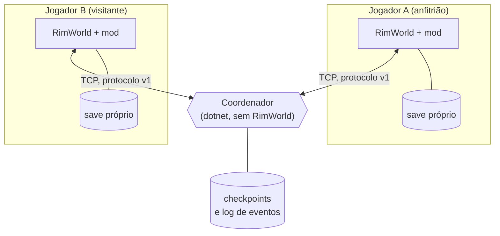
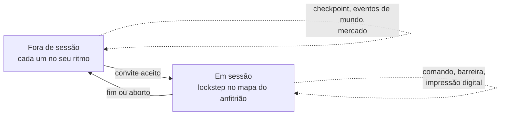
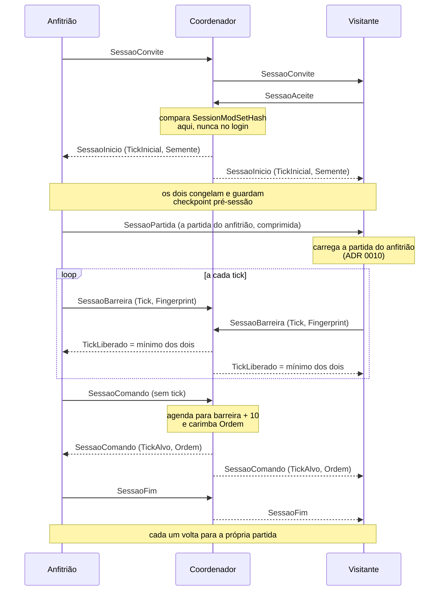
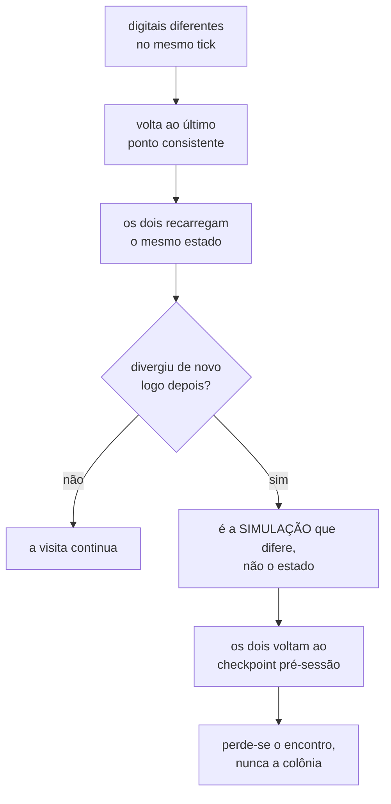
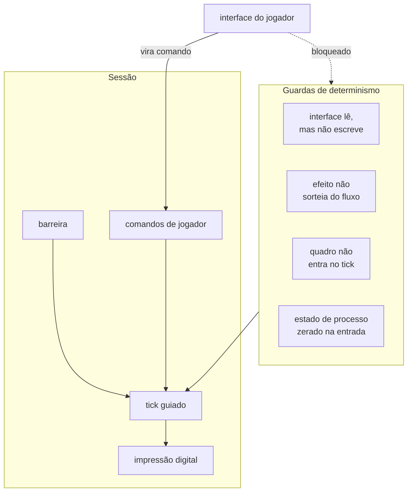

# Arquitetura

Três peças, e a terceira quase não sabe de jogo.

O coordenador **não valida regra de jogo**. Ele carimba ordem, guarda checkpoint,
difunde evento de mundo e aplica uma única regra de autoridade: decisão de
colônia é de quem mora nela. Ele lê um byte do comando, não um comando.

Isso é o que permite ele rodar em qualquer lugar e nunca precisar acompanhar
atualização do RimWorld.

## Os dois regimes

**Fora de sessão não existe sincronia por tick. Nenhuma.** O que trafega é
assíncrono: checkpoint da colônia, eventos de mundo, presença. Jogar sozinho
nunca depende de ninguém estar online.

**Dentro da sessão** os dois simulam o mesmo mapa, tick a tick, sob uma barreira
comum. É caro e frágil, e por isso dura pouco e tem ponto de retorno.

## O ciclo de uma visita

Quatro regras sustentam isso:

1. **O comando vai sem tick.** Quem agenda é o coordenador, para `barreira + 10`,
   e carimba a ordem. Os dois lados recebem o mesmo agendamento sem que o
   servidor entenda de RimWorld.
2. **`TickLiberado` é o mínimo entre os participantes.** Ninguém passa do mais
   lento, e qualquer um pausado congela a barreira.
3. **A impressão digital é o estado do RNG do intervalo.** Dois valores
   diferentes para o mesmo tick significam divergência.
4. **O ponto de rollback viaja junto**, no `UltimoTickValido`.

## O que acontece quando diverge

Refazer o ponto de junção resolve divergência de **estado**. Quando os dois
partem de um estado idêntico e se afastam de novo, o que difere é a simulação, e
insistir não adianta. Ver [[Determinismo]].

## Por dentro do cliente

Cada guarda existe por causa de uma divergência real, medida e reproduzida. As
treze já achadas estão em [[Determinismo]], com a família de cada uma.

## Onde ler mais

* [Arquitetura completa](https://github.com/matheus-fsc/RimWorld-WithFriends/blob/main/docs/ARQUITETURA.md)
* [Protocolo, mensagem por mensagem](https://github.com/matheus-fsc/RimWorld-WithFriends/blob/main/docs/PROTOCOLO.md)
* [Decisões registradas (ADR)](https://github.com/matheus-fsc/RimWorld-WithFriends/tree/main/docs/adr)
