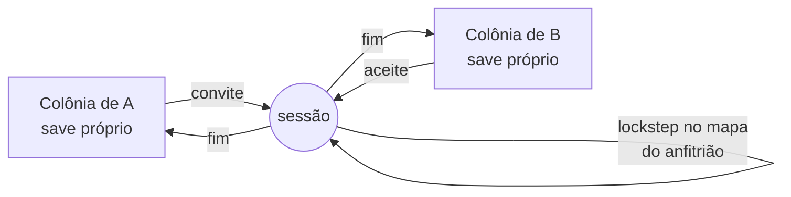
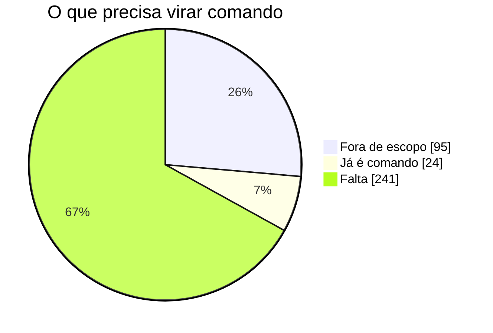

# With Friends

Mod de multiplayer para RimWorld 1.6.

> **Assíncrono por padrão. Síncrono por encontro.**

Cada jogador simula a própria colônia, no próprio ritmo, com save próprio. Quando
dois jogadores precisam interagir de verdade, entram numa **sessão**: uma janela
curta, aceita pelos dois, determinística, com ponto de retorno imediatamente
antes dela.

Fora de sessão não existe sincronia por tick. Nenhuma. E jogar sozinho nunca é
bloqueado pela ausência de ninguém.



## Onde está, em uma tela

| | |
|---|---|
| **Funciona** | duas instâncias simulam o mesmo mapa em lockstep, trocam comandos, detectam divergência e voltam a um ponto de junção em vez de abortar |
| **Não funciona** | a visita ainda diverge em partidas de verdade, cada vez mais tarde |
| **Testes** | 153 passando, 88 pontos de acoplamento catalogados e verificados na subida |
| **Regressão** | 3.992 ticks sem divergência na bancada |

**Mapeamento das decisões de jogador** (base: os 360 registros de sincronia do
Multiplayer):



Dos 241 que faltam, 119 dependem de identificar a ação de um botão, e a máquina
que resolve isso já está escrita.

**Divergência, sessão após sessão, conforme as causas foram consertadas** (tick
em que a visita quebrou, medido em 16/09/2026):

```
216  224  200  512  496  421  1000  1160  1744
```

As primeiras matavam a visita em três segundos de jogo. As últimas, em quase
trinta.

**Estimativa para uma visita de dez minutos com combate sobreviver de forma
confiável: dois a quatro meses**, no ritmo atual de algumas sessões jogadas por
semana. As premissas, as duas frentes e o que faria esse número subir ou descer
estão em [[Estado atual]].

## Por onde começar

| Página | O que responde |
|---|---|
| [[Por que existe]] | o que este mod faz que os dois existentes não fazem |
| [[Arquitetura]] | as três peças, o ciclo da visita e o que acontece quando diverge |
| [[Estado atual]] | o que funciona hoje, com números, e o que falta |
| [[Determinismo]] | por que duas máquinas divergem, e as treze causas já achadas |
| [[Bancada]] | como reproduzir uma visita inteira sem ninguém clicando |

## A premissa que autoriza o resto

O nome é a premissa: RimWorld **com amigos**. Um grupo pequeno que se conhece,
não um servidor com oitenta jogadores anônimos.

Isso não é modéstia, é o que torna viáveis as decisões caras do projeto. A visita
pode custar, porque acontece poucas vezes por sessão de jogo, com aviso e
consentimento. Uma fila de um encontro por vez basta. E confiança é premissa: o
coordenador não valida regra de jogo, porque os participantes se conhecem.

Projetar para oitenta desconhecidos mudaria tudo, e daria um mod pior para o caso
que importa.

## Licença e origem

Reusa mecanismos do [Multiplayer](https://github.com/rwmt/Multiplayer) (MIT,
Zetrith), em especial a detecção de divergência por estado de RNG e a abstração
de tempo. **Não é um fork**: a arquitetura aqui nega a premissa que sustenta
aquele código. Ver [[Por que existe]].
